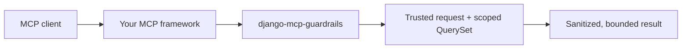

<div align="center">

# django-mcp-guardrails

Deny-by-default policy and output protection for Django apps that already
expose [Model Context Protocol](https://modelcontextprotocol.io/) tools.

[](https://github.com/VaughnDV/django-mcp-guardrails/actions/workflows/ci.yml)
[](LICENSE)
[](#status)
[](docs/release.md)
[](https://www.python.org/)
[](https://www.djangoproject.com/)
[](https://github.com/astral-sh/ruff)
[](https://mypy-lang.org/)

</div>

This package does **not** add another MCP transport, OAuth server, or
auto-published model catalog. It sits between the MCP framework you already
use and Django QuerySets, and it fails closed unless a tool has an explicit
policy.



## Contents

- [Status](#status)
- [Why](#why)
- [Quick start](#quick-start)
- [What is enforced](#what-is-enforced)
- [What this package does not do](#what-this-package-does-not-do)
- [Documentation](#documentation)
- [Development](#development)
- [Security](#security)
- [License](#license)

## Status

**Alpha.** Read policies, Django QuerySet integration, the
`django-mcp-server` adapter, cumulative export budgets, and privacy-safe
audit metadata are implemented. Write tools stay disabled.

A first **PyPI release is coming soon**. Until then, install from this
repository. `pip install django-mcp-guardrails` will not resolve from PyPI
yet.

## Why

MCP tools that wrap Django models are easy to over-expose: an empty allowlist
that means "everything", a client-supplied tenant id, a QuerySet dumped into
the response, or page-walking that reconstructs a table.

`django-mcp-guardrails` makes the opposite the default. A tool is not guarded
until you register a policy. Empty allowlists grant nothing. Identity comes
from the trusted request. QuerySets never leave the process as tool results.

## Quick start

### 1. Install

```bash
pip install "django-mcp-guardrails @ git+https://github.com/VaughnDV/django-mcp-guardrails.git"
```

If you already use [`django-mcp-server`](https://pypi.org/project/django-mcp-server/) 0.5.x:

```bash
pip install "django-mcp-guardrails[django-mcp-server] @ git+https://github.com/VaughnDV/django-mcp-guardrails.git"
```

Poetry:

```bash
poetry add "django-mcp-guardrails[django-mcp-server] @ git+https://github.com/VaughnDV/django-mcp-guardrails.git"
```

| Extra | Use it when |
| --- | --- |
| `django-mcp-server` | You register tools with django-mcp-server 0.5.x (needs MCP SDK 1.x). |
| `mcp-sdk` | You want the official MCP SDK declared; a dedicated adapter is not wrapped yet. |
| `audit` | Optional marker only — `AuditEvent` already ships with the Django app. |

### 2. Enable the Django app

```python
INSTALLED_APPS = [
    # ...
    "django_mcp_guardrails",
]
```

Then migrate if you plan to persist audit events:

```bash
python manage.py migrate django_mcp_guardrails
```

### 3. Declare a read policy

Scope the QuerySet from the trusted request **before** client filters. Return
fields, filter fields, lookups, and limits are allowlists — unknown keys are
rejected.

```python
from django_mcp_guardrails import ModelReadPolicy, PolicyContext, execute_model_read

from catalog.models import Item


def items_visible_to(request):
    return Item.objects.filter(organization_id=request.organization_id)


item_read_policy = ModelReadPolicy(
    model=Item,
    queryset=items_visible_to,
    return_fields={"id", "name", "status"},
    filter_fields={"name", "status"},
    ordering_fields={"name", "id"},
    lookups={"name": {"exact", "icontains"}, "status": {"exact", "in"}},
    default_limit=25,
    max_limit=100,
    max_session_rows=500,
    max_pages=10,
)
```

### 4. Run it from trusted context

Build `PolicyContext` from the Django request, never from tool arguments.
Client-supplied `user`, `organization`, `tenant`, or `role` keys are rejected.

```python
context = PolicyContext.from_request(
    request,
    get_organization_id=lambda req: getattr(req, "organization_id", None),
)
result = execute_model_read(
    item_read_policy,
    context,
    {"filters": {"name": "Acme"}, "limit": 10},
)
```

The result is a typed envelope (`items` + `meta`), not a QuerySet. Extra keys
and common secret field names are stripped even if someone allowlists them.

### 5. Optional: register with django-mcp-server

```python
from django_mcp_guardrails.adapters.django_mcp_server import register_guarded_model_tool

register_guarded_model_tool(
    policy=item_read_policy,
    name="search_items",
    get_organization_id=lambda request: getattr(request, "organization_id", None),
)
```

The adapter translates framework request context into the policy core. It does
not monkey-patch django-mcp-server. Unregistered tools are simply not added.

A complete walkthrough lives in [`example_project/`](example_project/README.md).

## What is enforced

| Guardrail | Default |
| --- | --- |
| Missing policy | Fail closed |
| Empty `return_fields` / `filter_fields` | Grant nothing |
| Identity and tenant | Trusted request only |
| Query vocabulary | `filters`, `ordering`, `page`, `limit`, `search` |
| Lookups in field names (`name__icontains`) | Rejected |
| Raw SQL, annotations, aggregations | Rejected |
| QuerySets / model instances in results | Rejected |
| Row, byte, and session export limits | Server-enforced |
| Audit payloads | Decisions and sizes, not prompts or results |
| Write tools | Disabled in 0.1 |

See the [policy reference](docs/policy-reference.md) for the query shape,
output envelope, budgets, and audit backends.

## What this package does not do

- Replace Django authentication, permissions, or database access controls
- Auto-expose models, admin actions, serializers, or URLs
- Implement MCP transports or an OAuth server
- Detect every prompt injection or prevent all cross-request inference
- Treat a `confirmed=true` tool argument as human confirmation

Residual risks are documented in the [threat model](docs/threat-model.md).

## Documentation

| Topic | Document |
| --- | --- |
| Policy semantics, queries, budgets, audit | [Policy reference](docs/policy-reference.md) |
| Framework extras and adapter behavior | [Adapter support matrix](docs/adapter-support.md) |
| Stable client-visible error codes | [Error codes](docs/error-codes.md) |
| Residual risks and non-goals | [Threat model](docs/threat-model.md) |
| Example Django app | [example_project](example_project/README.md) |
| Publishing | [Release guide](docs/release.md) |
| Docs index | [docs/README.md](docs/README.md) |

## Development

Poetry manages dependencies. [uv](https://docs.astral.sh/uv/) creates the
in-project `.venv`.

```bash
git clone https://github.com/VaughnDV/django-mcp-guardrails.git
cd django-mcp-guardrails
uv venv --python 3.11
poetry install --extras django-mcp-server
cp .env.example .env
poetry run pre-commit install
poetry run pytest
```

Quality gate: `ruff check .`, `ruff format --check .`, `mypy`. Full workflow
is in [CONTRIBUTING.md](CONTRIBUTING.md).

## Security

Do not open a public issue for vulnerabilities. Use
[private vulnerability reporting](https://github.com/VaughnDV/django-mcp-guardrails/security/advisories/new).
See [SECURITY.md](SECURITY.md).

## License

[MIT](LICENSE)
